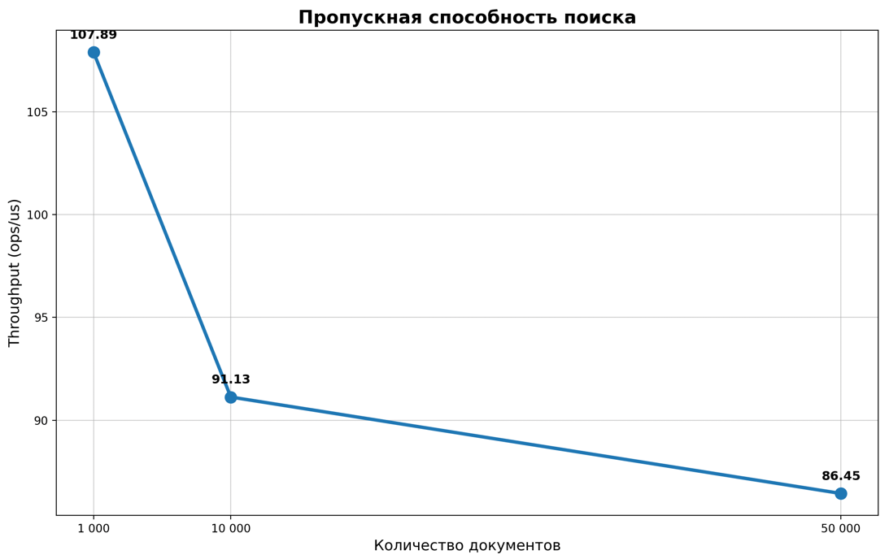
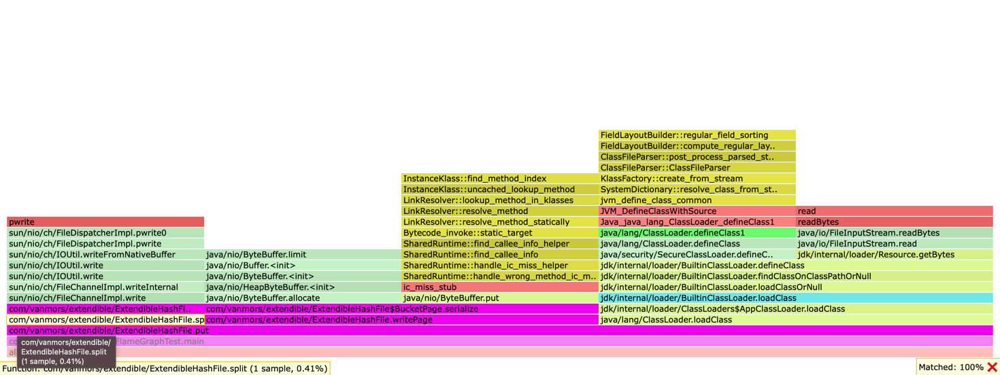
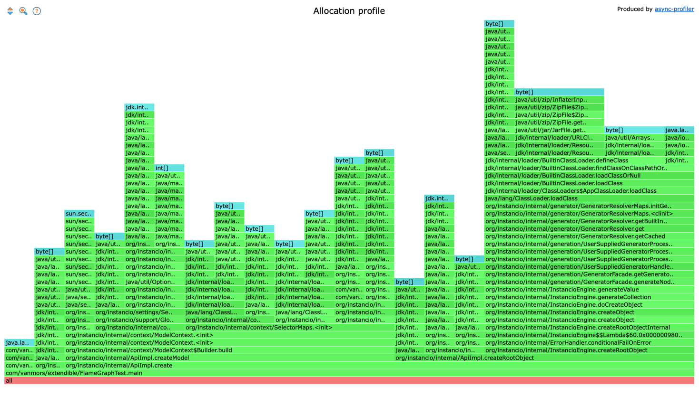

# Extendible Hash

### Цель работы:
Реализовать алгоритм Extendable Hash

Основные понятия  
Global Depth — глобальная глубина (сколько младших бит хеша используется для адресации в директории).  
Local Depth — локальная глубина каждой корзины (bucket). Показывает, сколько бит хеша действительно используется для этой конкретной корзины.  
Directory — массив указателей на страницы-корзины. Размер директории всегда равен 2^globalDepth.  
Bucket (корзина) — страница на диске, которая хранит записи (ключ + значение). Каждая корзина имеет свою localDepth.

Алгоритм вставки:  
1) Для ключа вычисляется хеш-функция.
2) Используются младшие биты хеша (в количестве globalDepth) для выбора индекса в каталоге.
3) Каталог указывает на соответствующий бакет, где производится поиск или вставка.

### Результаты производительности Extendible hashing

| Операция    | Размер (ключей) | Mode         | Score       | Error   | Units  |
|-------------|-----------------|--------------|-------------|---------|--------|
| `getRandom` | 1 000           | Throughput   | 107,893     | ± 3,729 | ops/us |
| `getRandom` | 10 000          | Throughput   | 91,133      | ± 1,165 | ops/us |
| `getRandom` | 50 000          | Throughput   | 86,447      | ± 2,597 | ops/us |
| `getRandom` | 1 000           | Average Time | 0,009       | ± 0,001 | us/op  |
| `getRandom` | 10 000          | Average Time | 0,012       | ± 0,001 | us/op  |
| `getRandom` | 50 000          | Average Time | 0,012       | ± 0,001 | us/op  |
| `insertAll` | 10 000          | Single Shot  | 162 908,326 | -       | ms/op  |

**Примечания:**
- `getRandom` — случайный поиск существующих ключей.
- `insertAll` — время построения структуры при вставке всех ключей (SingleShotTime).

1) Долгое время вставки из-за записи на диск при каждом put(), также при каждом split(), происходит put(). Можно добавить кэш, который будет хранить недавние бакеты. 

### Графики

CPU:

Memory: 

