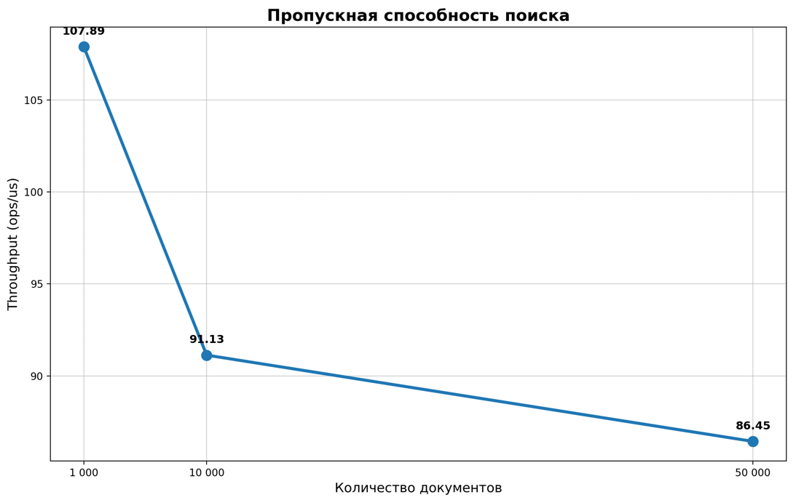
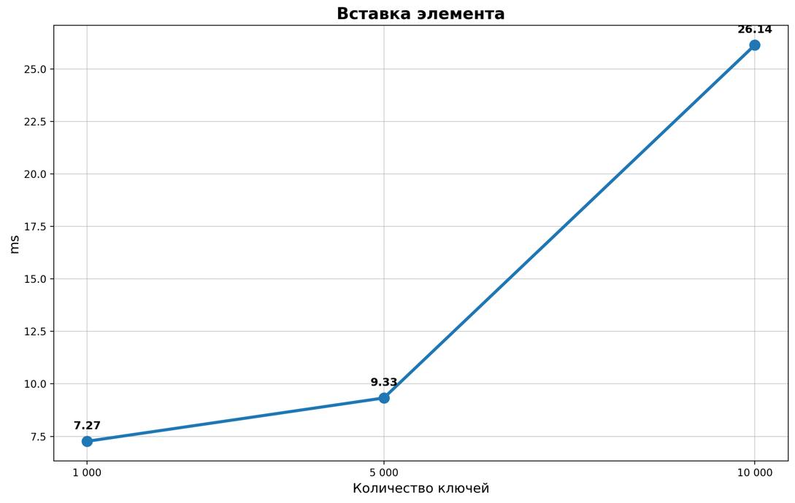
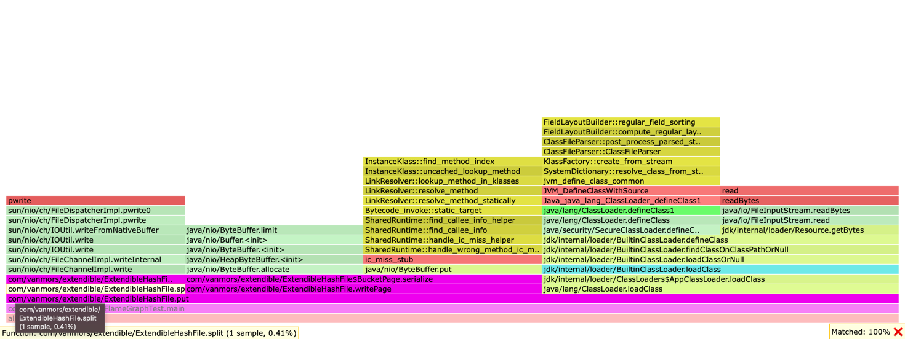
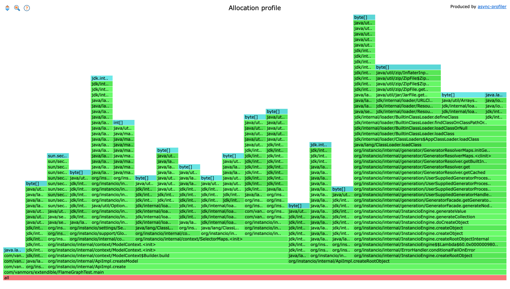
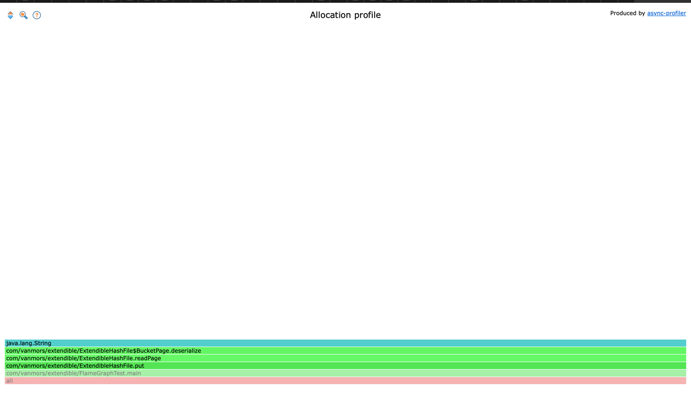

# Extendible Hash

### Цель работы:

Реализовать алгоритм Extendable Hash

Основные понятия  
Global Depth — глобальная глубина (сколько младших бит хеша используется для адресации в директории).  
Local Depth — локальная глубина каждой корзины (bucket). Показывает, сколько бит хеша действительно используется для
этой конкретной корзины.  
Directory — массив указателей на страницы-корзины. Размер директории всегда равен 2^globalDepth.  
Bucket (корзина) — страница на диске, которая хранит записи (ключ + значение). Каждая корзина имеет свою localDepth.

Алгоритм вставки:

1) Для ключа вычисляется хеш-функция.
2) Используются младшие биты хеша (в количестве globalDepth) для выбора индекса в каталоге.
3) Каталог указывает на соответствующий бакет, где производится поиск или вставка.

### Результаты производительности Extendible hashing

| Операция    | Размер (ключей) | Mode         | Score   | Error   | Units  |
|-------------|-----------------|--------------|---------|---------|--------|
| `getRandom` | 1 000           | Throughput   | 107,893 | ± 3,729 | ops/us |
| `getRandom` | 10 000          | Throughput   | 91,133  | ± 1,165 | ops/us |
| `getRandom` | 50 000          | Throughput   | 86,447  | ± 2,597 | ops/us |
| `getRandom` | 1 000           | Average Time | 0,009   | ± 0,001 | us/op  |
| `getRandom` | 10 000          | Average Time | 0,012   | ± 0,001 | us/op  |
| `getRandom` | 50 000          | Average Time | 0,012   | ± 0,001 | us/op  |
| `insert`    | 1 000           | Throughput   | 0,125   | ± 0,017 | ms/op  |
| `insert`    | 10 000          | Throughput   | 0,119   | ± 0,022 | ms/op  |
| `insert`    | 50 000          | Throughput   | 0,034   | ± 0,004 | ms/op  |
| `insert`    | 1 000           | Average Time | 7,267   | ± 0,432 | ms/op  |
| `insert`    | 10 000          | Average Time | 9,330   | ± 2,183 | ms/op  |
| `insert`    | 50 000          | Average Time | 26,135  | ± 2,449 | ms/op  |

**Примечания:**

- `getRandom` — случайный поиск существующего ключа.
- `insert` — время построения структуры при вставке одного ключа.

1) Долгое время вставки из-за записи на диск при каждом put(), также при каждом split(), происходит put(). Для решения
   этой проблемы был добавлен LRU cache, который по дефолту вмещает в себя 128 бакетов.

Теперь увеличение времени getRandom и insert происходи из-за cache miss.

Результаты теста с параметрами (32 записи в бакете, и кэш вмещает в себя: 1, 16, 128 бакетов)

| Операция  | Размер | Mode | Score | Error   | Units |
|-----------|--------|------|-------|---------|-------|
| getRandom | 1      | avgt | 5,981 | ± 0,576 | us/op |
| getRandom | 16     | avgt | 4,399 | ± 0,620 | us/op |
| getRandom | 128    | avgt | 0,616 | ± 0,092 | us/op |
| insert    | 1      | avgt | 8,252 | ± 0,733 | us/op |
| insert    | 16     | avgt | 7,261 | ± 0,573 | us/op |
| insert    | 128    | avgt | 3,135 | ± 0,287 | us/op |

### Графики

CPU:

Memory:
 

