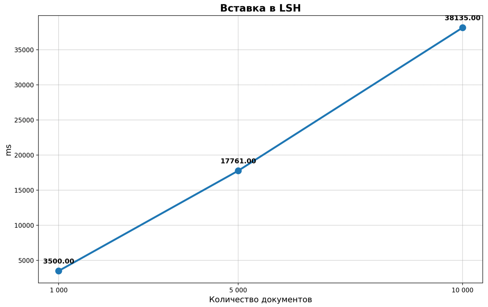
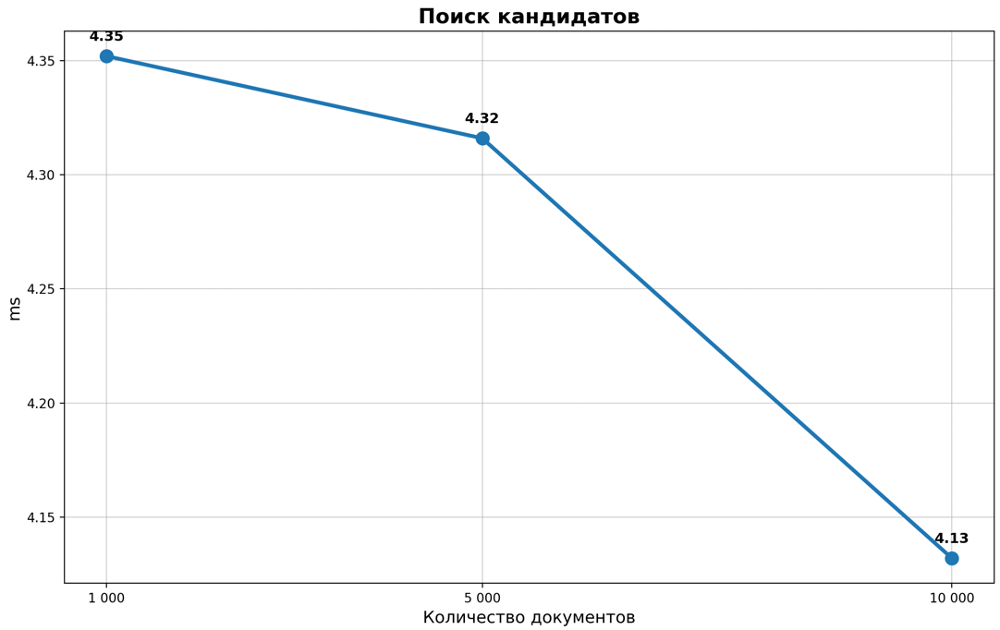
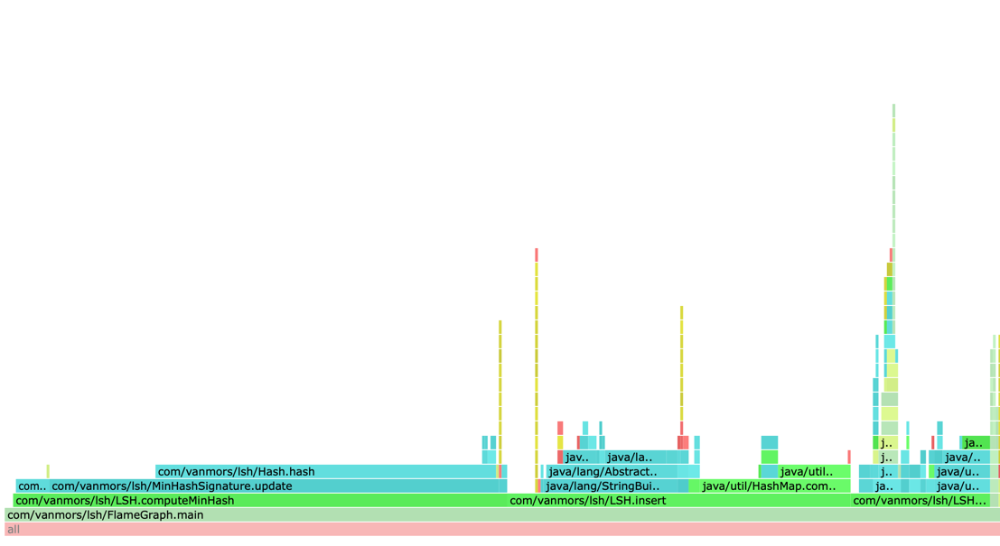
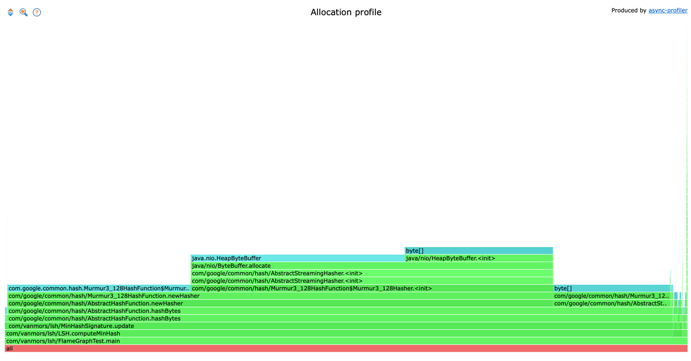

# LSH

### Цель работы:
Реализовать алгоритм Locality-Sensitive Hashing

В данной работе LSH используется в сочетании с MinHash. 

  
Документы представляются в виде набора k-шинглов (подстрок слов).  
Для каждого документа вычисляется MinHash-сигнатура - компактное представление документа.  
Сигнатура разбивается на полосы (bands). Если два документа совпадают хотя бы в одной полосе, они считаются кандидатами на дубликат.

1. Предобработка текста:
Приведение к нижнему регистру.
Удаление знаков препинания.
Разбиение на слова.
Генерация k-шинглов.

2. Вычисление MinHash-сигнатуры:
Для каждого шингла вычисляется хеш по 120 различным seed’ам.
Берётся минимальное значение для каждой хеш-функции.

3. Индексация (insert):
Сигнатура разбивается на полосы по 3 значения.
Для каждой полосы вычисляется строковый ключ.
Документ добавляется в соответствующее ведро (buckets).

4. Поиск кандидатов (query):
Для запрашиваемого документа вычисляются ключи всех полос.
Собираются все документы, попавшие хотя бы в одно общее ведро.
Сам документ исключается из результата.

### Результаты производительности

| Документов | Операция    | Mode  | Score     | Error    | Units  |
|------------|-------------|-------|-----------|----------|--------|
| 1 000      | insertAll   | thrpt | ~1.0×10⁻⁴ | -        | ops/us |
| 5 000      | insertAll   | thrpt | ~1.0×10⁻⁴ | -        | ops/us |
| 10 000     | insertAll   | thrpt | ~1.0×10⁻⁵ | -        | ops/us |
| 1 000      | queryRandom | thrpt | 0,227     | 0,012    | ops/us |
| 5 000      | queryRandom | thrpt | 0,241     | 0,004    | ops/us |
| 10 000     | queryRandom | thrpt | 0,239     | 0,005    | ops/us |
| 1 000      | insertAll   | avgt  | 3 500,89  | 33,44    | us/op  |
| 5 000      | insertAll   | avgt  | 17 761,89 | 151,90   | us/op  |
| 10 000     | insertAll   | avgt  | 38 135,66 | 1 282,19 | us/op  |
| 1 000      | queryRandom | avgt  | 4,352     | 0,295    | us/op  |
| 5 000      | queryRandom | avgt  | 4,316     | 0,169    | us/op  |
| 10 000     | queryRandom | avgt  | 4,132     | 0,064    | us/op  |

### Графики
Вставка в LSH  

Линейное увеличение времени в зависимости от количества документов.

Поиск кандидатов  

Примерно одинаковое время с учётом ошибки

### CPU

Самое затратное, поиск минимального хэша для сигнатуры

### Memory

