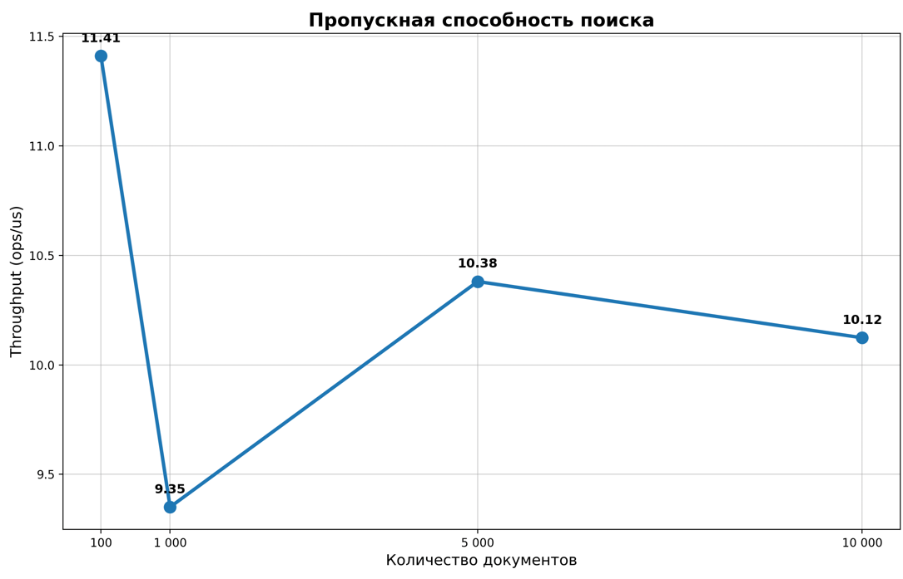
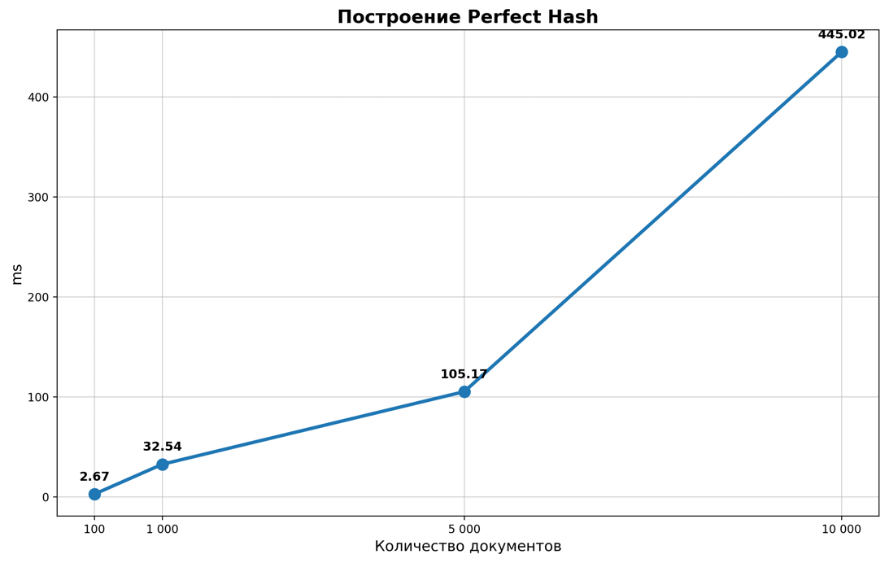
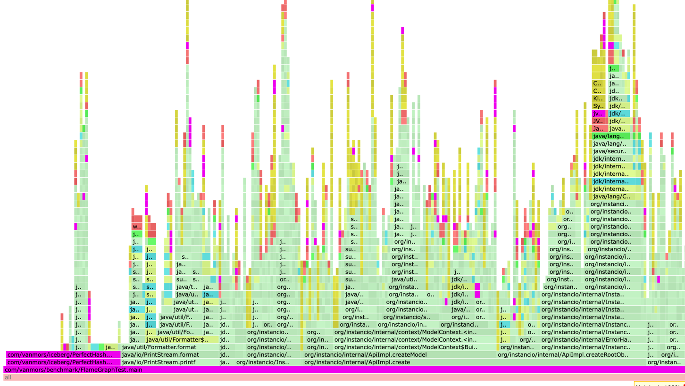
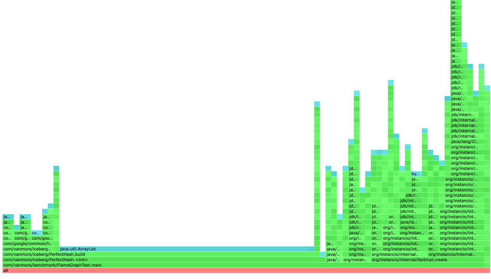

# Perfect Hash

### Цель работы:
Реализовать алгоритм Perfect Hash

Операции:
1. Построение Perfect Hash по неизменяемому количеству ключей.
2. Поиск по ключу

В данной реализации используется двухуровневая схема:  
Первый уровень — распределяет ключи по корзинам (buckets).  
Второй уровень — внутри каждой корзины подбирает смещение (seed), чтобы все ключи внутри неё получили уникальные финальные индексы.

### Результаты бенчмарков Perfect Hash

| Операция              | Количество ключей | Mode          | Cnt | Score       | Error         | Units    |
|-----------------------|-------------------|---------------|-----|-------------|---------------|----------|
| `lookup`              | 100               | Throughput    | 15  | 11,412      | ± 0,976       | ops/ms   |
| `lookup`              | 1 000             | Throughput    | 15  | 9,351       | ± 0,831       | ops/ms   |
| `lookup`              | 5 000             | Throughput    | 15  | 10,381      | ± 0,178       | ops/ms   |
| `lookup`              | 10 000            | Throughput    | 15  | 10,124      | ± 0,309       | ops/ms   |
| `buildOnly`           | 100               | Single Shot   | 15  | 2,673       | ± 2,850       | ms/op    |
| `buildOnly`           | 1 000             | Single Shot   | 15  | 32,544      | ± 38,971      | ms/op    |
| `buildOnly`           | 5 000             | Single Shot   | 15  | 105,165     | ± 36,701      | ms/op    |
| `buildOnly`           | 10 000            | Single Shot   | 15  | 445,016     | ± 216,380     | ms/op    |

**Примечания:**
- `lookup` — измеряет скорость поиска (`getIndex()`) в режиме пропускной способности.
- `buildOnly` — измеряет время построения Perfect Hash (SingleShotTime).

### Графики
Поиск 1000 ключей  

Примерно одинаковое время с учётом ошибки

Построение  

Увеличение время, в зависимости от количества ключей

### CPU

### Memory
