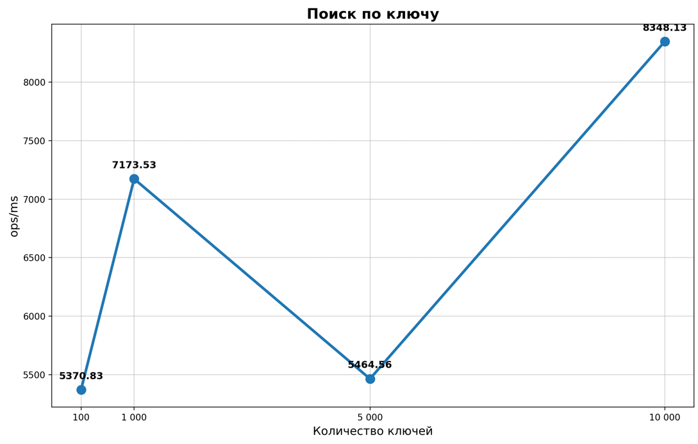
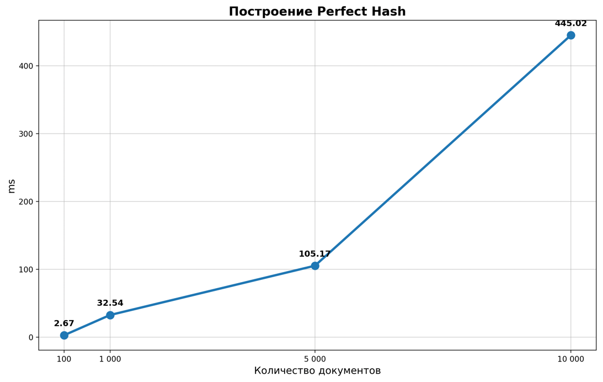
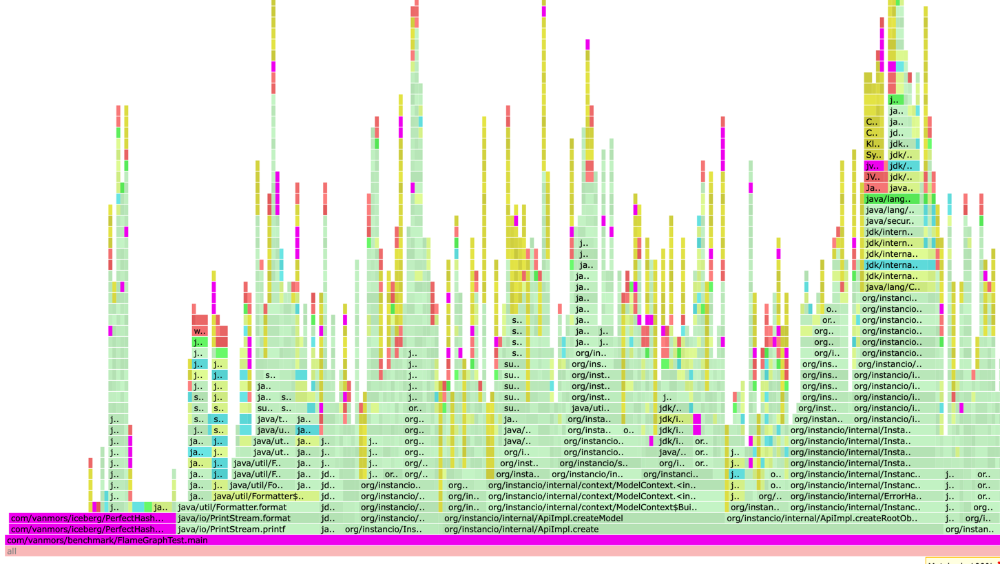
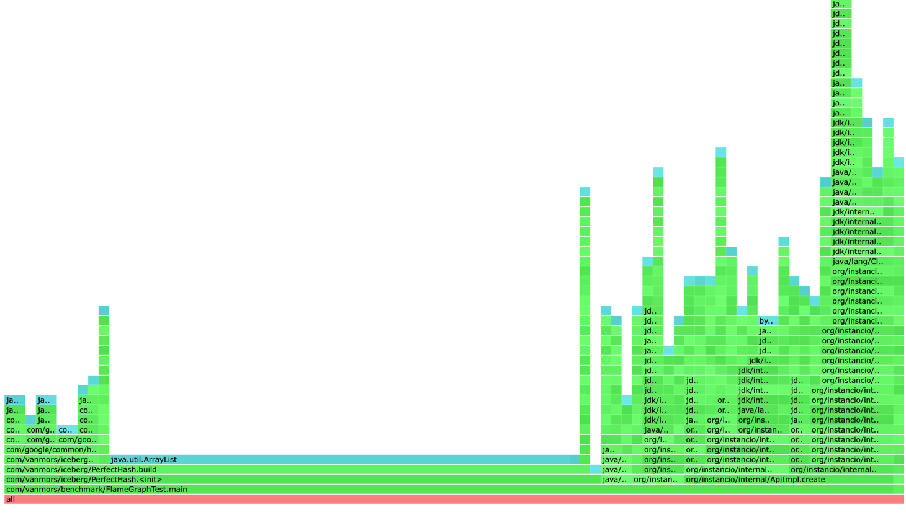

# Perfect Hash

### Цель работы:
Реализовать алгоритм Perfect Hash

Операции:
1. Построение Perfect Hash по неизменяемому количеству ключей.
2. Поиск по ключу

В данной реализации используется двухуровневая схема:  
Первый уровень — распределяет ключи по корзинам (buckets).  
Второй уровень — внутри каждой корзины подбирает смещение (seed), чтобы все ключи внутри неё получили уникальные финальные индексы.

### Результаты бенчмарков Perfect Hash

| Операция    | Количество ключей | Mode        | Score    | Error      | Units  |
|-------------|-------------------|-------------|----------|------------|--------|
| `lookup`    | 100               | Throughput  | 5370,827 | ± 196,232  | ops/ms |
| `lookup`    | 1 000             | Throughput  | 7173,527 | ± 0,831    | ops/ms |
| `lookup`    | 5 000             | Throughput  | 5464,564 | ± 318,902  | ops/ms |
| `lookup`    | 10 000            | Throughput  | 8348,129 | ± 1373,110 | ops/ms |
| `buildOnly` | 100               | Single Shot | 2,673    | ± 1,088    | ms/op  |
| `buildOnly` | 1 000             | Single Shot | 32,544   | ± 16,407   | ms/op  |
| `buildOnly` | 5 000             | Single Shot | 105,165  | ± 42,512   | ms/op  |
| `buildOnly` | 10 000            | Single Shot | 445,016  | ± 176,195  | ms/op  |

**Примечания:**
- `lookup` — измеряет скорость поиска (`getIndex()`) в режиме пропускной способности.
- `buildOnly` — измеряет время построения Perfect Hash (SingleShotTime).

### Графики
Поиск одного ключа  

Примерно одинаковое время с учётом ошибки

Построение  

Увеличение время, в зависимости от количества ключей

### CPU

### Memory
