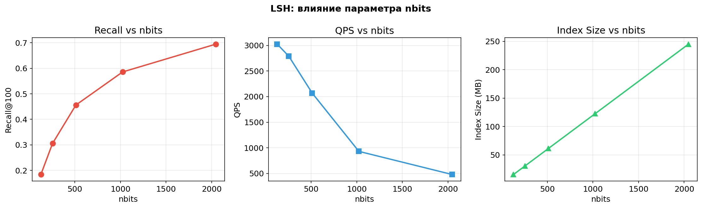
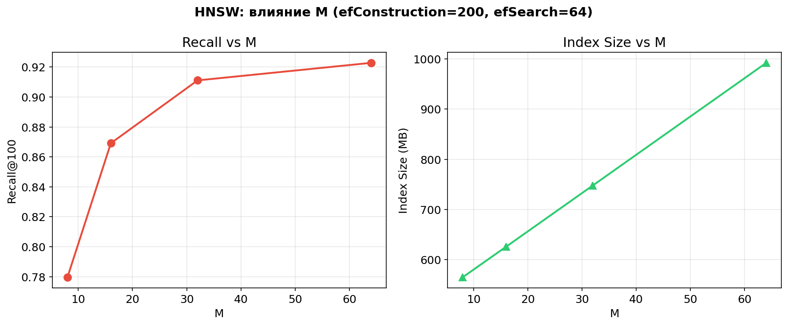
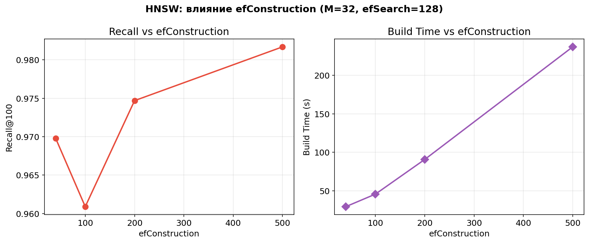
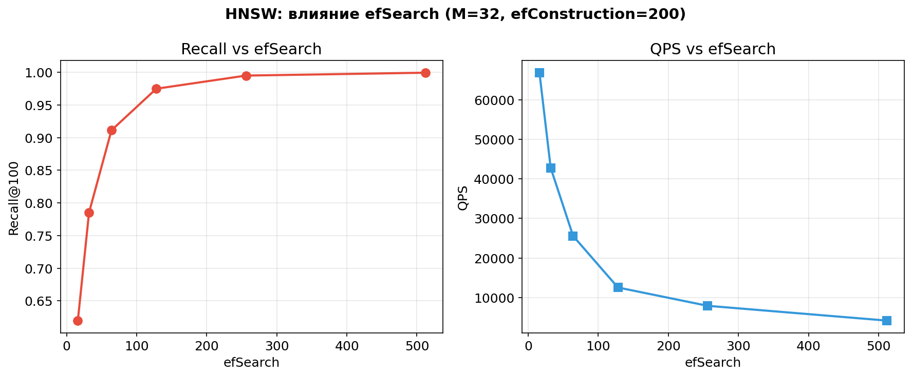
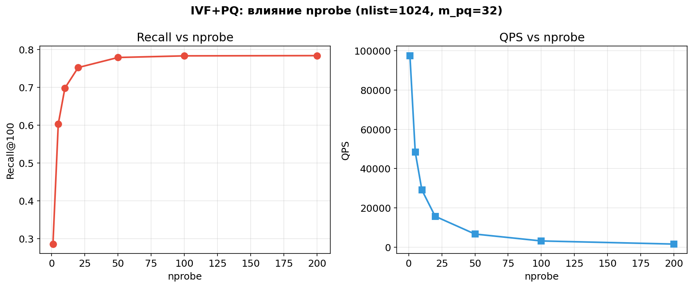
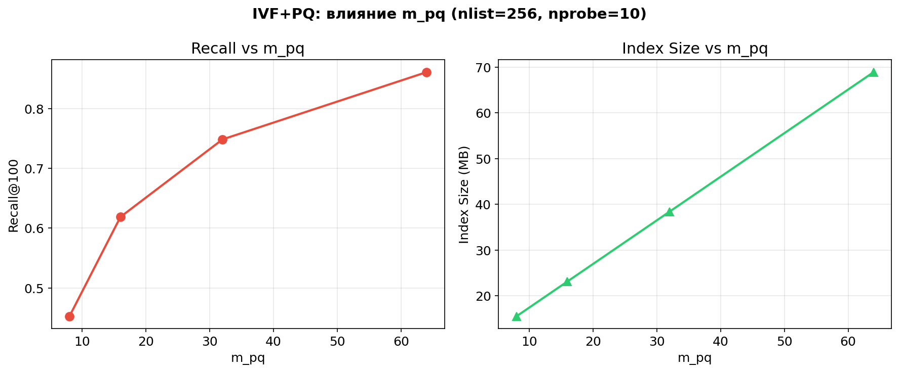
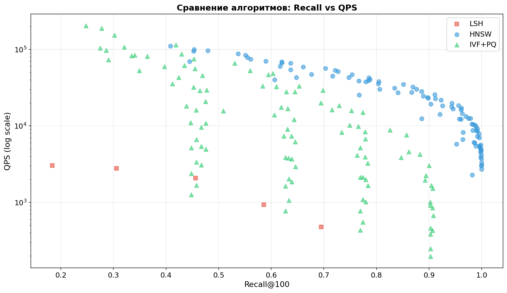
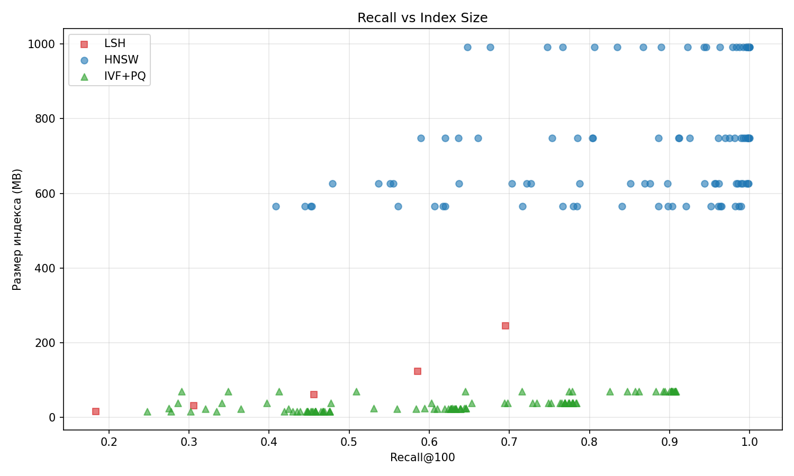
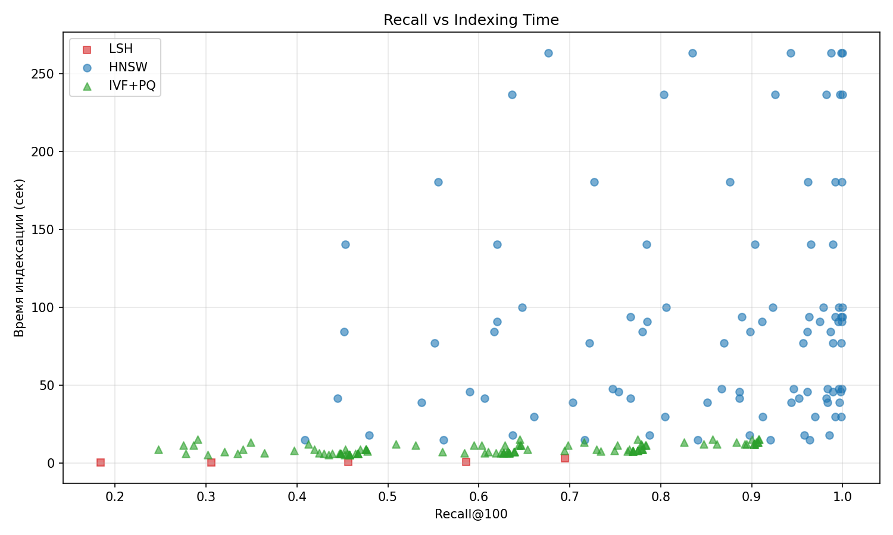

# Бенчмарк ANN-алгоритмов: LSH, HNSW, IVF+PQ

Сравнительный анализ трёх алгоритмов приближённого поиска ближайших соседей (ANN) на
датасете SIFT1M с использованием библиотеки FAISS.

---

## Датасет

**SIFT1M** — датасет для оценки ANN-алгоритмов, состоящий из SIFT:

| Параметр           | Значение                                              |
|--------------------|-------------------------------------------------------|
| Базовые вектора    | 1 000 000                                             |
| Запросы            | 10 000                                                |
| Размерность        | 128                                                   |
| Метрика расстояния | L2 (евклидово)                                        |
| Ground truth       | 100 ближайших соседей на запрос                       |

---

## Метрики

Для каждой конфигурации параметров измеряются четыре метрики:

| Метрика             | Описание                                                                                          |
|---------------------|---------------------------------------------------------------------------------------------------|
| **Recall@100**      | Доля правильно найденных соседей из 100 истинных. Значение от 0 до 1, где 1 — идеальный результат |
| **QPS**             | Queries Per Second — число запросов, обработанных за секунду. Чем больше, тем лучше               |
| **Index Size (MB)** | Размер индекса в мегабайтах. Определяет потребление оперативной памяти                            |
| **Build Time (s)**  | Время построения индекса в секундах                                                               |

---

## Алгоритмы и параметры

### 1. LSH

**Реализация:** `faiss.IndexLSH(dim, nbits)`

#### Параметр: `nbits`

Количество гиперплоскостей, используемых для создания хэш-кода.

| nbits | Recall@100 | QPS   | Index Size (MB) | Build Time (s) |
|-------|------------|-------|-----------------|----------------|
| 128   | 0.1838     | 3 861 | 15.3            | 0.15           |
| 256   | 0.3056     | 2 920 | 30.6            | 0.26           |
| 512   | 0.4561     | 2 030 | 61.3            | 0.47           |
| 1024  | 0.5857     | 924   | 122.6           | 1.79           |
| 2048  | 0.6949     | 508   | 245.1           | 3.57           |

**Влияние `nbits`:**

- **Recall** растёт с увеличением nbits: более точное хранение, меньше ложных коллизий
- **QPS** падает: сравнение более длинных векторов занимает больше времени
- **Index Size** растёт линейно: каждый вектор хранится как битовая строка длины nbits

**Вывод:** даже при максимальном nbits=2048 recall не достигает 0.7 - LSH принципиально ограничен точностью хэширования.
При этом скорость поиска значительно уступает HNSW и IVF+PQ.

---

### 2. HNSW

**Принцип работы:** HNSW строит многослойный навигационный граф. На верхних уровнях - разреженный граф для быстрого
приближения к нужной области. На нижних - плотный граф для точного поиска. Поиск начинается сверху и «спускается» по
уровням, на каждом жадно перемещаясь к ближайшим вершинам.

**Реализация:** `faiss.IndexHNSWFlat(dim, M)`

HNSW имеет три ключевых параметра, каждый из которых управляет отдельным аспектом работы.

#### Параметр: `M` — максимальное число рёбер у вершины

M определяет связность графа: каждая вершина хранит до M соседей на каждом уровне (на нулевом уровне — до 2M).

| M  | Recall@100 | QPS    | Index Size (MB) | Build Time (s) |
|----|------------|--------|-----------------|----------------|
| 8  | 0.780      | 42 645 | 565             | 65.9           |
| 16 | 0.869      | 28 991 | 626             | 109.5          |
| 32 | 0.911      | 23 697 | 748             | 112.6          |
| 64 | 0.923      | 20 678 | 992             | 121.2          |

Остальные параметры: efConstruction=200, efSearch=64

**Влияние `M`:**

- **Recall** растёт: более связный граф позволяет находить лучшие пути к ближайшим соседям
- **Index Size** растёт линейно: больше рёбер — больше памяти на хранение ссылок (от 565 до 992 MB)
- **Build Time** растёт: при добавлении вершины нужно поддерживать больше связей
- Выигрыш в recall от M=32 к M=64 минимален (+1.2%), а памяти уходит на 33% больше

#### Параметр: `efConstruction` — размер списка кандидатов при построении

efConstruction задаёт, сколько кандидатов рассматривается при построении графа для выбора лучших соседей новой вершины.
Влияет на качество рёбер, но не на размер индекса.

| efConstruction | Recall@100 | Build Time (s) |
|----------------|------------|----------------|
| 40             | 0.970      | 36.7           |
| 100            | 0.961      | 54.7           |
| 200            | 0.975      | 112.6          |
| 500            | 0.982      | 275.7          |

Остальные параметры: M=32, efSearch=128

**Влияние `efConstruction`:**

- **Recall** растёт незначительно (1-2%): рёбра становятся качественнее, но прирост быстро насыщается
- **Build Time** растёт линейно: при efConstruction=500 построение занимает 275 секунд vs 37 секунд при
  efConstruction=40
- На практике значения efConstruction=100-200 дают оптимальный баланс

#### Параметр: `efSearch` — размер списка кандидатов при поиске

efSearch — главный рычаг для настройки компромисса recall/скорость. Определяет ширину поиска по графу на
этапе запроса. Не влияет на построение индекса.

| efSearch | Recall@100 | QPS    |
|----------|------------|--------|
| 16       | 0.620      | 62 642 |
| 32       | 0.786      | 40 020 |
| 64       | 0.911      | 23 697 |
| 128      | 0.975      | 13 278 |
| 256      | 0.995      | 7 203  |
| 512      | 0.999      | 3 641  |

Остальные параметры: M=32, efConstruction=200

**Влияние `efSearch`:**

- **Recall** быстро растёт от 0.62 до 0.99
- **QPS** падает обратно пропорционально: удвоение efSearch примерно вдвое снижает скорость
- Значение efSearch=64-128 даёт хороший баланс (recall >0.91 при >13K QPS)

---

### 3. IVF+PQ

Это составной алгоритм из двух компонентов:

#### IVF (Inverted File Index)

Пространство разбивается на `nlist` ячеек с помощью k-means кластеризации. При поиске вместо перебора всех 1M
точек обходим только `nprobe` ближайших кластеров - это даёт ускорение в `nlist/nprobe` раз.

#### PQ (Product Quantization)

Product Quantization сжимает вектора с потерями

**Реализация:** `faiss.IndexIVFPQ(quantizer, dim, nlist, m_pq, 8)`

#### Параметр: `nprobe` - число кластеров для обхода при поиске

nprobe - главный параметр настройки скорость/recall для IVF. Определяет, сколько кластеров из nlist проверяется при
каждом запросе. Не влияет на построение индекса.

| nprobe | Recall@100 | QPS     |
|--------|------------|---------|
| 1      | 0.286      | 104 483 |
| 5      | 0.603      | 50 787  |
| 10     | 0.698      | 28 544  |
| 20     | 0.752      | 15 960  |
| 50     | 0.779      | 6 516   |
| 100    | 0.783      | 2 985   |

Остальные параметры: nlist=1024, m_pq=32

**Влияние `nprobe`:**

- **Recall** быстро растёт при малых nprobe (от 0.29 при nprobe=1 до 0.70 при nprobe=10), затем насыщается - потому что
  PQ-квантизация вносит собственную ошибку, которую nprobe не может скомпенсировать
- **QPS** падает линейно с ростом nprobe: вдвое больше кластеров - вдвое медленнее
- Оптимальное значение nprobe=10-20: основной прирост recall уже получен, дальнейшее увеличение неэффективно

#### Параметр: `m_pq` - число подвекторов (подпространств)

m_pq определяет степень сжатия. Должен быть делителем размерности вектора (128).

| m_pq | Recall@100 | Index Size (MB) | Сжатие вектора         |
|------|------------|-----------------|------------------------|
| 8    | 0.452      | 15.5            | 128 float32 -> 8 байт  |
| 16   | 0.619      | 23.1            | 128 float32 -> 16 байт |
| 32   | 0.749      | 38.4            | 128 float32 -> 32 байт |
| 64   | 0.907      | 69.3            | 128 float32 -> 64 байт |

Остальные параметры: nlist=256, nprobe=10

**Влияние `m_pq`:**

- **Recall** растёт: больше подвекторов - более точная аппроксимация расстояний (каждый подвектор кодируется независимо,
  более короткие подвектора лучше аппроксимируются 256 центроидами)
- **Index Size** растёт линейно: каждый вектор занимает ровно m_pq байт
- Увеличение m_pq с 8 до 32 повышает recall на 0.30, при этом индекс всё равно остаётся компактным (38 MB vs 748 MB у
  HNSW)

#### Параметр: `nlist` - число кластеров

| nlist | Recall@100 | QPS    | Build Time (s) |
|-------|------------|--------|----------------|
| 100   | 0.763      | 3 842  | 7.8            |
| 256   | 0.749      | 9 429  | 8.5            |
| 512   | 0.729      | 17 712 | 9.2            |
| 1024  | 0.698      | 28 544 | 11.5           |

Остальные параметры: m_pq=32, nprobe=10

**Влияние `nlist`:**

- **QPS** растёт с увеличением nlist: мельче кластеры - меньше вектор в каждом кластере - быстрее поиск в пределах
  nprobe кластеров
- **Recall** слегка падает при фиксированном nprobe: при nlist=1024 и nprobe=10 мы просматриваем лишь ~1% данных (
  10/1024), и можем пропустить ближайших соседей, находящихся в соседних кластерах
- Компенсировать можно увеличением nprobe, но это снижает QPS
- **Build Time** растёт незначительно: основная стоимость - обучение k-means

---

## Результаты бенчмарков

### Общее сравнение: Recall vs QPS

### Recall vs Index Size

### Recall vs Build Time

### Лучшие конфигурации каждого алгоритма

| Алгоритм | Recall | QPS    | Index (MB) | Build (s) | Параметры                              |
|----------|--------|--------|------------|-----------|----------------------------------------|
| LSH      | 0.695  | 508    | 245        | 3.6       | nbits=2048                             |
| HNSW     | 0.911  | 23 697 | 748        | 112.6     | M=32, efConstruction=200, efSearch=64  |
| HNSW     | 0.999  | 3 641  | 748        | 112.6     | M=32, efConstruction=200, efSearch=512 |
| IVF+PQ   | 0.783  | 2 985  | 38.8       | 11.5      | nlist=1024, m_pq=32, nprobe=100        |
| IVF+PQ   | 0.603  | 50 787 | 38.8       | 11.5      | nlist=1024, m_pq=32, nprobe=5          |

### Полная сводка по 192 конфигурациям

| Алгоритм | Конфигураций | Recall (min-max) | QPS (min-max)   | Index Size (MB) |
|----------|--------------|------------------|-----------------|-----------------|
| LSH      | 5            | 0.18 - 0.70      | 508 - 3 861     | 15 -245         |
| HNSW     | 96           | 0.41 - 0.99      | 2 171 - 110 089 | 565 - 992       |
| IVF+PQ   | 72           | 0.25 - 0.78      | 404 - 217 342   | 15 - 39         |

---

## Сравнительный анализ

### HNSW vs IVF+PQ vs LSH

| Критерий                   | HNSW       | IVF+PQ      | LSH        |
|----------------------------|------------|-------------|------------|
| Максимальный recall        | **0.9998** | 0.7833      | 0.6949     |
| Макс. QPS                  | 110 089    | **217 342** | 3 861      |
| Мин. размер индекса        | 565 MB     | **15 MB**   | 15 MB      |
| Мин. время построения      | 14.9 s     | **5.4 s**   | **0.15 s** |
| Recall > 0.9 при QPS > 10K | **Да**     | Нет         | Нет        |

### Ключевые наблюдения

1. **HNSW - лидер по качеству поиска.** Единственный алгоритм, стабильно достигающий recall >0.95 при QPS >10K. При
   M=32, efSearch=64 даёт recall 0.91 при 24K QPS.

2. **IVF+PQ - лидер по компактности.** Индекс занимает 15-39 MB - в 20-50 раз меньше, чем HNSW. Важно для
   миллиардных датасетов, когда индекс должен поместиться в RAM.

3. **IVF+PQ - лидер по пиковому QPS.** При nprobe=1 и nlist=1024 достигает 217K QPS, но recall при этом всего 0.25-0.29.
   Для сценариев, где допустим невысокий recall, IVF+PQ обеспечивает максимальную пропускную способность.

4. **LSH - худший вариант.** Не достигает recall >0.70, при этом QPS значительно ниже конкурентов.

---

## Выводы

| Сценарий                              | Рекомендуемый алгоритм | Конфигурация                           |
|---------------------------------------|------------------------|----------------------------------------|
| Высокий recall, RAM не ограничен      | HNSW                   | M=32, efConstruction=200, efSearch=128 |
| Максимальный recall любой ценой       | HNSW                   | M=64, efConstruction=500, efSearch=512 |
| Ограниченная RAM (миллиарды векторов) | IVF+PQ                 | nlist=1024, m_pq=64, nprobe=20         |
| Максимальный QPS, recall не критичен  | IVF+PQ                 | nlist=1024, m_pq=8, nprobe=1           |
| Быстрое прототипирование              | LSH                    | nbits=512                              |